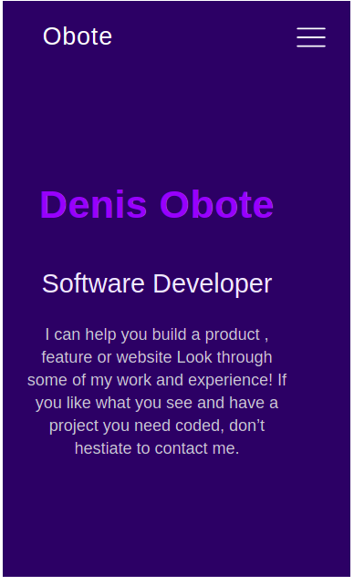

## Pop up module

working on pop up module on microverse bootcamp 

## Built With

- hmtl
- css
- JavaScript
## Live Demo

[Live Demo Link](https://obote.github.io/myportfolio/)

## Install

Clone the project and run  it.

## Authors

👤 **Denis Obote**

- GitHub: [@Obote](https://github.com/Obote)
- Twitter: [@Obote_denis](https://twitter.com/Obote_denis)
- LinkedIn: [Obote Denis](https://www.linkedin.com/in/obote-denis-9859a2a3/)

## 🤝 Contributing

Contributions, issues, and feature requests are welcome!

Feel free to check the [issues page](../../issues/).

## Show your support

Give a ⭐️ if you like this project!

## Acknowledgments

Nicolae for the rendered during the learning process.

## 📝 License

This project is [MIT](./MIT.md) licensed.